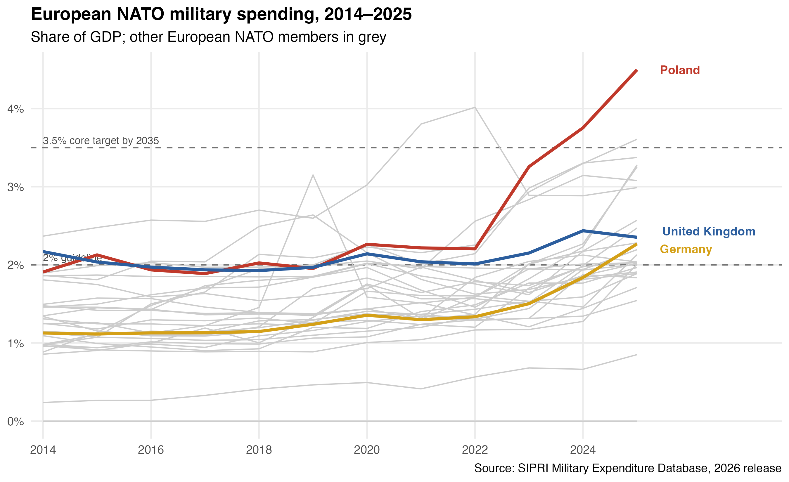
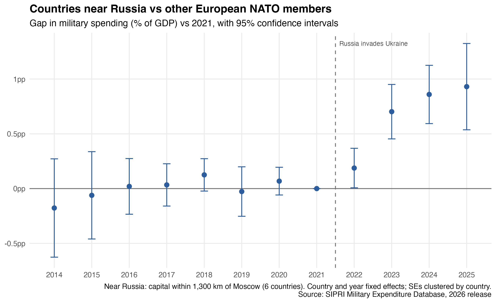

# European Defence Spending Tracker

How has military spending by European NATO members changed since 2014, how close are they to NATO's spending targets, and did countries closer to Russia respond more strongly after 2022?



## Key findings

- **Poland** has pulled away from the rest of Europe. Its spending was around 2% of GDP until 2022, then more than doubled to about 4.5% in 2025, well above NATO's new 3.5% core target.
- **Germany** moved from roughly 1.1% of GDP in 2014 to about 2.3% in 2025, with most of the increase coming after Russia's full-scale invasion of Ukraine in 2022.
- **The United Kingdom** stayed close to 2% for most of the period and reached around 2.4% in 2024–25.
- Most European NATO members were below the 2% guideline in 2014. By 2025, most are at or above it, but only a few are near 3.5%.

## Did proximity to Russia shape the response to 2022?



The six European NATO members whose capitals are within 1,300 km of Moscow (Estonia, Finland,
Latvia, Lithuania, Poland and Sweden) increased military spending by **0.67 percentage points of
GDP more** than the other 23 members after 2022 (standard error 0.13).

- **Gradual response:** the gap was small in 2022 (+0.19pp, borderline), when budgets were largely
  set before the invasion, then grew to +0.70pp in 2023, +0.86pp in 2024 and +0.93pp in 2025.
  Treating 2023 as the first post year gives +0.81pp.
- **Pre-trends:** gaps in 2014–2020 are small and every 95% interval includes zero, with no
  systematic slope (linear pre-trend p = 0.54). A joint Wald test does reject at 5% (p = 0.03),
  driven by year-to-year noise rather than a trend, so the evidence here is mixed.
- **Caveats:** only six countries are treated, so clustered standard errors are likely too small.
  Finland (2023) and Sweden (2024) joined NATO during the post-period, so proximity and accession
  overlap. NATO's targets also changed (2% as a floor at Vilnius in 2023, 3.5% core at The Hague
  in 2025); year fixed effects absorb these only if all members responded equally. Poland's very
  large increase may drive part of the result.

These results are descriptive. They show that spending diverged by distance from Russia, not that
proximity alone caused it.

### Estimation method

1. Computed the great-circle distance from each capital to Moscow (`geosphere::distHaversine`,
   capital coordinates from the `maps` package).
2. Defined "near Russia" as a capital within 1,300 km, the natural gap between Sweden (1,229 km)
   and Romania (1,500 km).
3. Two-way fixed effects: share of GDP on near × post-2022, with country and year fixed effects and
   standard errors clustered by country (`fixest`).
4. Event study: separate near × year coefficients relative to 2021, plus a joint Wald test on the
   2014–2020 coefficients.

## Data

- **Source:** [SIPRI Military Expenditure Database](https://www.sipri.org/databases/milex), 2026 release (file `SIPRI-Milex-data-1949-2025_v1.2.xlsx`, downloaded [28 September 2026]).
- **Measure:** military expenditure as a share of GDP ("Share of GDP" sheet).
- **Countries:** the 29 European NATO members with armed forces. Iceland is excluded because it has no armed forces, so SIPRI records its spending as zero.
- **Licence:** SIPRI data is free for non-commercial use with attribution. The raw file is not included in this repo; see *How to run* below.

## Data preparation

1. Read the "Share of GDP" sheet, detecting the header row automatically.
2. Reshaped the data from wide (one column per year) to long format: country, year, share of GDP.
3. Converted SIPRI's missing-value codes (`...`, `xxx`) to `NA`, and converted shares from fractions to percentages.
4. Removed region headings and footnote rows.
5. Filtered to European NATO members from 2014 (the year of the Wales Summit 2% pledge) onwards.

### SIPRI vs NATO figures

SIPRI and NATO define military spending differently. For example, NATO's definition includes some items, such as certain pensions and paramilitary forces, that SIPRI treats differently. So the figures here will not always match NATO's official estimates. SIPRI is used because it applies one consistent definition across all countries and years.

## How to run

Requires R (4.3 or later) and RStudio or Positron.

1. Clone this repo and open `defence-spending-tracker.Rproj`.
2. Restore the package versions used:
```r
   renv::restore()
```
3. Download the SIPRI Excel file from the link above and save it in `data/raw/`.
4. Rebuild everything (tests, charts, analysis and report) with one command:
```r
   source("run.R")
```
5. Run the tests:
```r
   testthat::test_dir("tests/testthat")
```
## Project structure

```
defence-spending-tracker/
├── R/
│   ├── sipri_functions.R           # reusable functions: read, clean, filter, chart, distance
│   ├── 01_sipri_chart.R            # share-of-GDP chart
│   ├── 02_proximity_twfe.R         # TWFE estimate of the proximity effect
│   └── 03_proximity_event_study.R  # event study and pre-trend test
├── tests/testthat/                 # unit tests for the functions
├── data/raw/                       # SIPRI file goes here (not tracked by Git)
├── outputs/                        # saved charts
├── sipri_report.qmd                # Quarto report
├── run.R                           # runs tests, analysis and report in one go
├── renv.lock                       # package versions
└── README.md
```

## Next steps

- Robustness checks: drop Poland; use log distance as a continuous treatment; wild cluster
  bootstrap or permutation inference given the small number of treated countries.
- Add real-terms spending (constant US$) alongside share of GDP.

---

*Personal project using publicly available data.*
